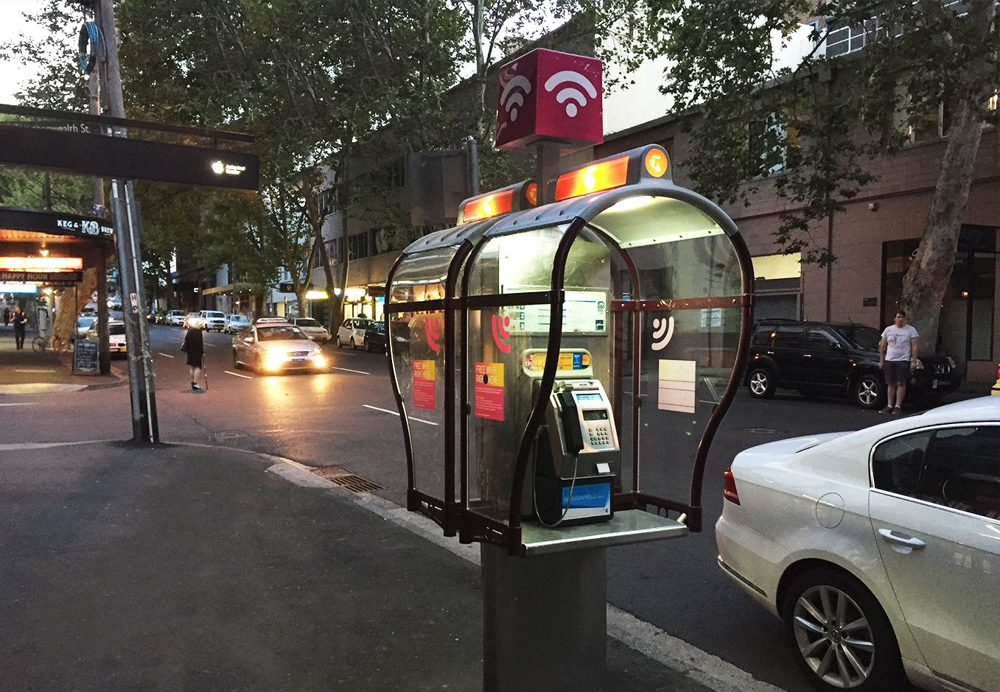
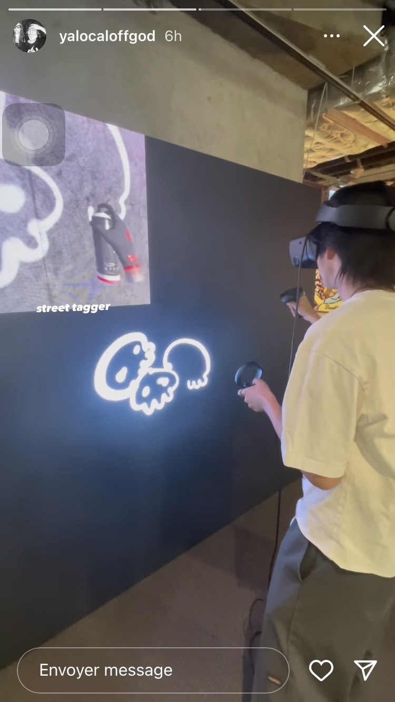
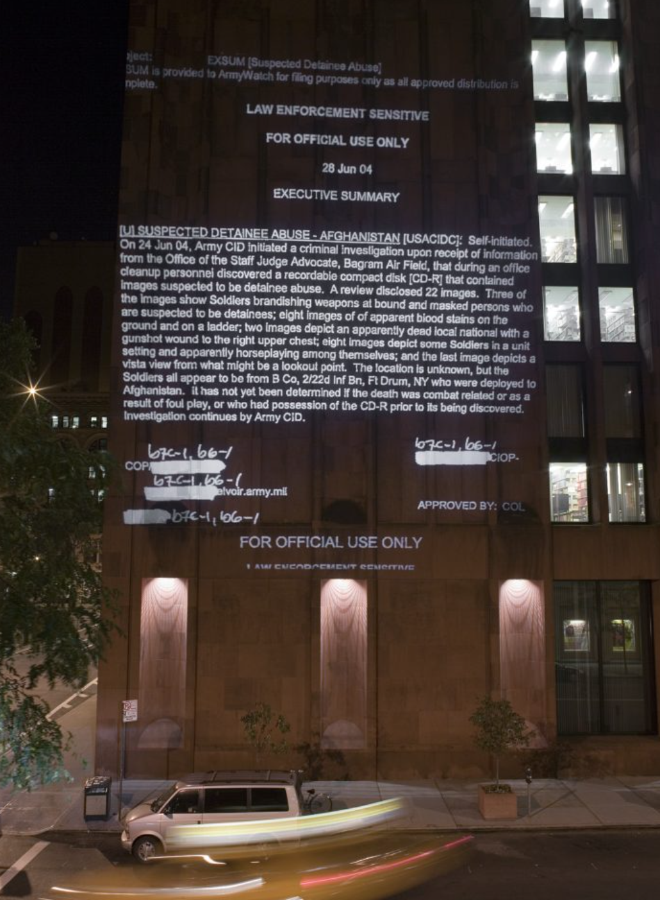

THESIS

1.

Physical -> relating to things perceived through the senses as opposed to the mind; tangible or concrete. "the physical world".

Virtual -> not physically existing as such but made by software to appear to do so.
"virtual images".

Digital -> involving or relating to the use of computer technology.
"the digital revolution".

Tangible -> perceptible by touch.
"the atmosphere of neglect and abandonment was almost tangible".

Space -> an area reserved for some particular purpose.
I don’t necessarily mean space as a physical one.

World -> a group of things such as countries or animals, or an area of human activity or understanding.

Experience -> an event or occurrence which leaves an impression on someone.

Bridging -> something that bridges the gap between two very different things has some of the qualities of each of these things.

Merging -> combine or cause to combine to form a single entity.

Traditional -> habitually done, used, or found.

Assign -> allocate (a job or duty).

Destruction -> the action or process of causing so much damage to something that it no longer exists or cannot be repaired.

Codes -> a set of conventions or moral principles governing behavior in a particular sphere.

Vandalism -> action involving deliberate destruction of or damage to public or private property.

Outdated -> old-fashioned and therefore not as good or as fashionable as something modern.

Obsolete -> no longer produced or used; out of date.

Adaptive reuse -> is the use of buildings, materials and products for purposes other than originally intended.

Mixed Reality -> a medium consisting of immersive computer-generated environments in which elements of a physical and virtual environment are combined.

Future Spaces -> spaces that have their functionality and experience redefined and rethought.

Reclaiming public property -> retrieving government-owned property through an action carrying a meaning.

The impact of technology on human experience/condition -> How technology influences humans in their regular experience of reality.

Redefining a landscape -> Taking the same actors and changing their roles by changing their functionalities. Reusing an obsolete space or object to give it new functionalities in tune with the times.

**POTENTIAL RESSEARCH QUESTIONS**

Future Spaces : How technology redefined our habits and needs.

Bridging Spaces : How the advent of the digital world forced us to rethink the ordinary.

Technological convergence : How overlapping technologies gave birth to hybrid spaces.

2.

https://blog.richardvanhooijdonk.com/en/the-metaverse-blurring-the-lines-between-our-physical-and-virtual-worlds/

https://www.goodnet.org/articles/repurposing-iconic-red-phone-booths

https://recyclenation.com/2011/02/recycled-repurposed-phone-booths/

https://harvardlawreview.org/print/vol-133/property-and-projection/

https://www.pbs.org/newshour/arts/projection-light-artists-protest

https://www.researchgate.net/publication/290907830_Adaptive_Reuse_in_Craft_Design_and_Art_in_the_City

https://www.aiga.org/sites/default/files/2021-02/Bridging%20Digital%20and%20Physical%20Experiences.pdf

https://drarch.org/index.php/drarch/article/view/22

https://medium.com/xrpractices/extending-the-reality-of-museum-eb953a2f35c9

https://venturebeat.com/business/mixed-reality-and-the-art-world-an-unlikely-but-ideal-pairing/

3.

